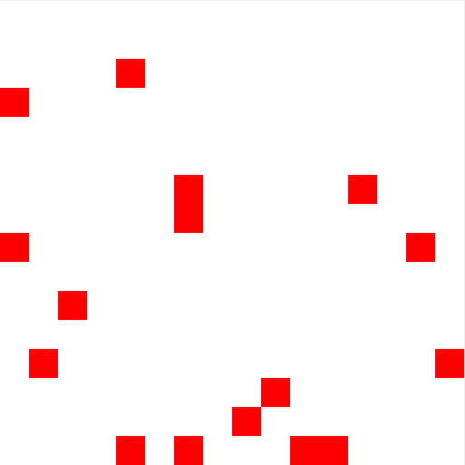
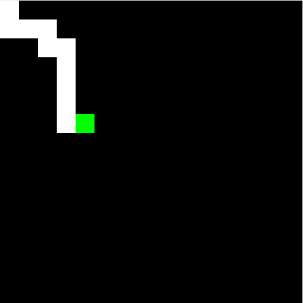

# escapa-minas
Proyecto de Máquinas Digitales 2020\
Pontificia Universidad Javeriana

Juego creado en lenguaje ensamblador ASM para procesador MIPS en el emulador MARS

## Juego
El Juego consiste en colocar minas aleatorias y mostrarlas al jugador durante un breve periodo de tiempo, luego la pantalla se pondrá en negro y el jugador deberá desplazarse por el escenario sin pisar una mina hasta llegar a la esquina inferior derecha, Si se pisa una mina el juego termina mostrando una pantalla de muerte, si se logra llegar al final una pantalla de victoria de muestra, además. El juego reproduce sonidos en 8-bits durante cada una de estas etapas.

| Capturas del juego  |                    |
| ------------------- | ------------------ |
|  |  |
|    |   |

## ¿Cómo correr?
1. Abrir el simulador ['MIPS MARS'](http://courses.missouristate.edu/kenvollmar/mars/) (MIPS.jar)
2. Abrir el archivo './src/main.asm' en el simulador MIPS
3. Abrir un bitmap display con dirección 0x10000000 (global data)
4. Ajustar display para un tamaño de 16x16 píxeles (32/512)
5. Conectar el bitmap display al simulador
6. Ensamblar y correr main.asm

## Simulador MIPS
Se hace uso del simulador MARS
>  MARS is a lightweight interactive development environment (IDE) for programming in MIPS assembly language, intended for educational-level use with Patterson and Hennessy's Computer Organization and Design. 

Una versión de MARS se encuentra en este repositorio 'MIPS.jar' pero puede ser descargado [haciéndo click aquí](http://courses.missouristate.edu/kenvollmar/mars/)

## Autores
* Ángel Talero
* Humberto Rueda
* Juan David Robledo